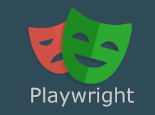

# Playwright Java + TestNG Self-Healing POC

This project demonstrates a production-style UI automation framework using:

- Playwright (Java)
- TestNG
- Page Object Model (POM)
- Custom self-healing locator mechanism
- Screenshots and trace capture on failure

## Why this project
The goal is to show how Playwright can be used in Java-based teams to build
stable, maintainable UI automation, while reducing flakiness caused by minor
UI locator changes.

## Key Features
- Playwright Java with TestNG
- Page Object Model structure
- Self-healing locators using primary + fallback strategy
- Healing decisions logged to console
- Screenshot and Playwright trace captured on failure
- Eclipse-friendly setup (no CLI dependency required)

## Self-Healing Example
Each UI element defines:
- a primary locator
- one or more fallback locators

If the primary locator fails, the framework automatically retries fallback
locators and logs which one was used.

Example log:
[SELF-HEAL] 'Username Field' fell back from [css=#user-name-broken] to [css=input[name='user-name']]
PASSED: tests.LoginSmokeTest.login_should_navigate_to_products

## How to run (Eclipse)
1. Import project as Maven project
2. Install Playwright browsers by running `PlaywrightBrowserInstall`
3. Right-click any TestNG test → Run As → TestNG Test

## Demo Application
Tests use https://www.saucedemo.com for demonstration purposes only.
